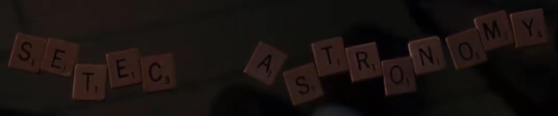

# Setec Astronomy



An **active-warden** text scrubber, packaged as a Claude Code skill with plain
CLIs underneath. It pushes text through a paraphrase model you choose, which
destroys hidden **token-level LLM steganography** and LLM watermarks while
keeping the meaning intact.

Two separate channels get closed. The **token-choice** channel dies in the
paraphrase. The **character** channel (zero-width and invisible characters,
homoglyphs, variation selectors, tag characters, bidi controls) is stripped
first, by a deterministic Unicode pass that needs nothing outside the standard
library. Running that pass first also keeps hidden instructions from
prompt-injecting the paraphraser.

## Install as a Claude Code skill

Copy this directory into your skills folder so the agent can find it:

```bash
cp -r setec-astronomy ~/.claude/skills/setec-astronomy      # user-level
# or: .claude/skills/setec-astronomy inside a project
```

Then ask for something like "scrub this text of any hidden channels". The
instructions the agent follows live in [SKILL.md](SKILL.md). It needs a backend
and key first, set up in the next section.

## Bring your own backend + key

Any OpenAI-compatible chat API works:

```bash
cp .env.example .env      # then edit
# Fireworks:  SETEC_BASE_URL=https://api.fireworks.ai/inference/v1
# OpenAI:     SETEC_BASE_URL=https://api.openai.com/v1
# OpenRouter: SETEC_BASE_URL=https://openrouter.ai/api/v1
# Ollama:     SETEC_BASE_URL=http://localhost:11434/v1   (local, keyless)
set -a && . ./.env && set +a
```

## Run it as a CLI

```bash
# Scrub (the main capability): only Python stdlib required
printf '%s' "Some possibly-steganographic text." | python scripts/warden.py
# JSON output with metrics:
python scripts/warden.py --text "..." --strength 0.7 --json
# Aggressive: also fold everything to plain ASCII (lossy)
python scripts/warden.py --text "..." --ascii
```

`--ascii` is the heaviest character-layer scrub on offer. Accents get
transliterated, homoglyphs folded (including **single-script** spoofs, such as an
all-Cyrillic word that reads as Latin), and whatever non-ASCII survives is
dropped. It is lossy: legitimate non-Latin text such as accented names, Chinese,
Japanese, Korean, and emoji gets transliterated or removed. Hence it stays off by default. Reach for it when
the content was meant to be ASCII anyway.

`tiktoken` is optional (`pip install -r requirements.txt`). With it, the divergence
metric counts real subword (BPE) tokens, closer to how a model actually tokenizes;
without it, the fallback splits on whole words and punctuation, which is coarser and
can under- or over-count how many tokens really changed.

## Token-level steganography demo (optional)

`scripts/stego.py` embeds and extracts a real token-level channel using a local
GPT-2. It codes Huffman-per-token, which puts it in the detectable
[bins/Huffman family](https://arxiv.org/abs/1705.10742);
[arithmetic coding](https://arxiv.org/abs/1909.01496) is the near-secure upgrade.
Needs the heavier deps (`pip install -r requirements-stego.txt`). Embed a secret,
scrub the cover text, watch extraction fall apart:

```bash
COVER=$(python scripts/stego.py embed --secret "meet at dawn")
python scripts/stego.py extract --text "$COVER"     # -> meet at dawn
printf '%s' "$COVER" | python scripts/warden.py     # scrub
python scripts/stego.py extract --text "<scrubbed>" # -> desync, no message
```

### End-to-end run

Run end-to-end on 2026-08-12: GPT-2 (`transformers`, CPU, fixed seed) for the
channel, and the real `warden.py` scrubbing through a local Ollama
(`llama3.2:3b`, keyless).

**1. Embed a secret, and confirm a clean roundtrip.**

```console
$ COVER=$(python scripts/stego.py embed --secret "meet at dawn")
$ python scripts/stego.py extract --text "$COVER"
meet at dawn
```

The cover text GPT-2 produced:

> the city will fall into the low teens-t.b area next around 9 o'clock. The
> forecast is pretty good now, and

**2. Scrub it through the real warden.**

```console
$ printf '%s' "$COVER" | python scripts/warden.py --json --strength 0.7
```

The paraphrase, meaning intact:

> The temperature is expected to drop into the low teens-T.B. area by
> approximately 9 o'clock, with current forecast conditions being quite
> favorable at present.

| field | value | what it means |
|---|---|---|
| `first_divergence_index` | `0` | the first token already changed; a sequential decoder desyncs here and loses everything after it. This is the number that matters. |
| `token_divergence` | `0.6154` | 62% of tokens differ (10 of 26 retained), counted by a general-purpose tokenizer that serves as a surface-rewrite yardstick |
| `channel_broken_high_confidence` | `true` | first change is early and divergence is high |

**3. Extract from the scrubbed text. The channel is gone.**

```console
$ python scripts/stego.py extract --text "<scrubbed text>"
[no recoverable message] desync: token 464 not in codebook. The text was altered ...

$ python scripts/stego.py extract --text "$COVER"   # control: original still decodes
meet at dawn
```

Step 3 is the proof: the real GPT-2 decoder desyncs, and the numbers corroborate
it. The operative one is `first_divergence_index`, because a sequential coder
loses everything past the first altered token; `token_divergence` is a coarse
surface-rewrite proxy whose exact value matters less than how early that first
change lands. A lower-entropy carrier gives the rewrite less room and scores
lower.

## The detection problem

Provably-secure token-level steganography ([Meteor](https://eprint.iacr.org/2021/686),
[Discop](https://dingjinyang.github.io/publication/sp23_discop/),
[minimum-entropy coupling](https://arxiv.org/abs/2210.14889)) samples from the
*same distribution* as ordinary generation. No statistical test separates it from
a normal completion.

With detection off the table, the remaining option is destruction. The payload rides
on the exact sequence of token choices. Paraphrasing re-samples that surface
form, and the receiver's decoder desyncs into nothing. Details in
[docs/llm-token-steganography.md](docs/llm-token-steganography.md).

What this cannot do is prove that zero capacity remains. A scheme hardened with
resynchronization or error correction may survive part of the rewrite, and so may
very low-entropy text. The tool therefore reports a *measured* token divergence
instead of a verdict.

## The trust problem

The same theorem that rules out detection rules out your own checks: you cannot
tell whether your provider wove a channel into the text it hands back. So it comes
down to trust. Concretely, you are trusting that nothing is hidden in the text they
return. Two things could be riding in it. One is a watermark you never agreed to,
marking the text as generated by their model. The other is hidden data: a copy of
your own prompt, so your input leaks wherever the reply travels, or someone else's
payload (stolen data, abuse-material identifiers, coordinates) threaded through
prose that reads as completely ordinary.

The two are not equally easy to pull off. A watermark only needs a detectable
statistical signal in the token choices, and its detector re-reads the tokens with
a key, so it is cheap and robust. Hidden data has to be decoded by whoever receives
it, which takes a channel with the determinism and error-correction a watermark
never needs, and any desync drops the payload. So an unwanted watermark is the more
practical risk, and a large, reliable exfiltration the harder one.

Whatever it is, once the text is in your hands it becomes your problem: you store
it, forward it downstream, and cannot see what rides along. Scrubbing it first
destroys the channel, so it no longer matters what was hidden, or by whom.

## How much fits in the channel

Channel capacity is the entropy of the model's next-token distribution: wherever
the model is genuinely uncertain, an encoder can pick among the plausible tokens,
and each choice carries bits. Rough rates: about 1 bit per token for a Meteor-class
provably-secure scheme (its security guarantee wastes entropy, so throughput drops
well below the per-token entropy available); around 2.5 for fluent English at
temperature 1; and about 4.5 for the detectable top-256 Huffman coding in
`scripts/stego.py` (measured, 4.3 to 4.6 across sample secrets). Taking 2.5, each
row below is tokens × 2.5 bits / 8:

| carrier | tokens | hidden payload |
|---|---:|---:|
| one chat reply | 500 | 156 B |
| a 100k-word novel | 133,000 | 42 KB |
| one coding agent on an internal repo, per day | 140,000 | 44 KB |
| a public-facing support bot, per year | 219M | 68 MB |

A whole novel holds roughly one low-resolution JPEG. That capacity still matters,
because the things worth stealing are small. An AES-256 key or a
BIP-39 seed is 32 bytes, about 100 tokens, one paragraph. An AWS key pair
fits in a single reply and a full `.env` in one long document. Bandwidth is
modest, but the encoder picks *which* bytes leave, so 156 bytes per response is
enough for four complete cryptographic keys.

That is the case for closing the channel even though your provider already holds
your prompts in plaintext and needs no covert route to read them. The hidden bits
matter to anyone who can influence generation without reaching the prompt store,
and to anyone moving data across a boundary that inspects content. The payload
leaves through the normal API, in prose indistinguishable from every other
response, at volumes that look like the product working. Data-loss-prevention
(DLP) tooling, which inspects outbound traffic for sensitive data leaving the
network, has nothing to flag.

The 1 and 2.5 figures are literature estimates, not measurements of any particular
deployment; only the 4.5 for `scripts/stego.py` is measured here. Low-entropy text
(code, boilerplate, rigid formats) carries far less.

## Read the code first

Every line is plain, unminified Python. The scrubber core
(`scripts/warden.py`, `scripts/llm.py`) imports nothing beyond the standard
library apart from optional `tiktoken`. Read it first, then supply your key.

## Repository layout

```
SKILL.md                     Claude Code skill manifest + instructions
scripts/llm.py               provider-agnostic OpenAI-compatible client (stdlib)
scripts/warden.py            active-warden scrubber + divergence metric
scripts/unicode_scrub.py     deterministic Unicode sanitizer (invisibles, homoglyphs, bidi)
scripts/stego.py             token-level steganography demo (GPT-2; optional heavy deps)
requirements.txt             optional: tiktoken (better divergence metric)
requirements-stego.txt       torch + transformers (only for stego.py)
requirements-dev.txt         black + pre-commit (formatting gate)
.pre-commit-config.yaml      runs black on commit; installed by post_create.sh
.env.example                 endpoint/key/model templates for 4 providers
docs/                        the research note behind all of this
```

## License

MIT. See [LICENSE](LICENSE).
